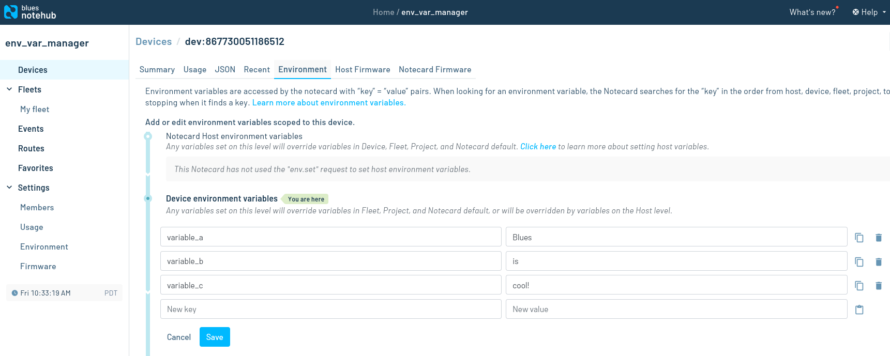

# Arduino Example

A simple example showing how to use the Notecard Environment Variable Manager (NEVM) with Arduino.

## `arduino.ino`

This file contains the example code. Before building it, you'll first need to uncomment this line:

```c
// #define PRODUCT_UID "com.your-company:your-product-name"
```

and replace `com.your-company:your-product-name` with [the ProductUID](https://dev.blues.io/notehub/notehub-walkthrough/#finding-a-productuid) from a [Notehub](https://dev.blues.io/notehub/notehub-walkthrough/) project.

The `arduino.ino` code sends a request to Notehub every 20 seconds for these environment variables:

- `variable_a`
- `variable_b`
- `variable_c`

## Notehub

Navigate to your [Notehub project](https://notehub.io/projects), click the Devices tab, double-click your device, and open the Environment tab. Under "Device environment variables", set a value for each variable and click Save:



## Hardware

We'll be using [the Swan](https://dev.blues.io/swan/introduction-to-swan/) as our target MCU. You will also need

- Micro USB cable
- Notecard
- Cellular antenna
- Notecarrier F

You can get the Notecard, antenna, and Notecarrier F all in one bundle with the [Blues Starter Kit](https://shop.blues.io/collections/blues-starter-kits).

## Arduino IDE

Open the IDE and follow these two sections of the [Swan Quickstart](https://dev.blues.io/quickstart/swan-quickstart) to get set up for Swan development:

- [Installing STM32duino in the Arduino IDE](https://dev.blues.io/quickstart/swan-quickstart/#installing-stm32duino-in-the-arduino-ide)
- [Using STM32duino in the Arduino IDE](https://dev.blues.io/quickstart/swan-quickstart/#using-stm32duino-in-the-arduino-ide)

Then, install the Notecard Arduino library by following [these instructions](https://dev.blues.io/tools-and-sdks/firmware-libraries/arduino-library/#installation)

Navigate to File > Open > and select `arduino.ino` on your filesystem. Follow [these instructions](https://dev.blues.io/quickstart/swan-quickstart/#programming-swan-the-stlink-v3mini) to prepare the Swan for programming and click the Upload button.

Click Tools > Serial Monitor and set the baud rate to 115200 baud. You should see this output like this:

```
Fetch interval lapsed. Fetching environment variables...
{"req":"env.get","names":["variable_a","variable_b","variable_c"]}
{"body":{"variable_a":"Blues","variable_b":"is","variable_c":"cool!"}}
variable_a has value Blues
variable_b has value is
variable_c has value cool!
```

If you change the value of one of the variables on Notehub, you should see that reflected in the serial output shortly:

```
Fetch interval lapsed. Fetching environment variables...
{"req":"env.get","names":["variable_a","variable_b","variable_c"]}
{"body":{"variable_a":"IoT","variable_b":"is","variable_c":"cool!"}}
variable_a has value IoT
variable_b has value is
variable_c has value cool!
```
